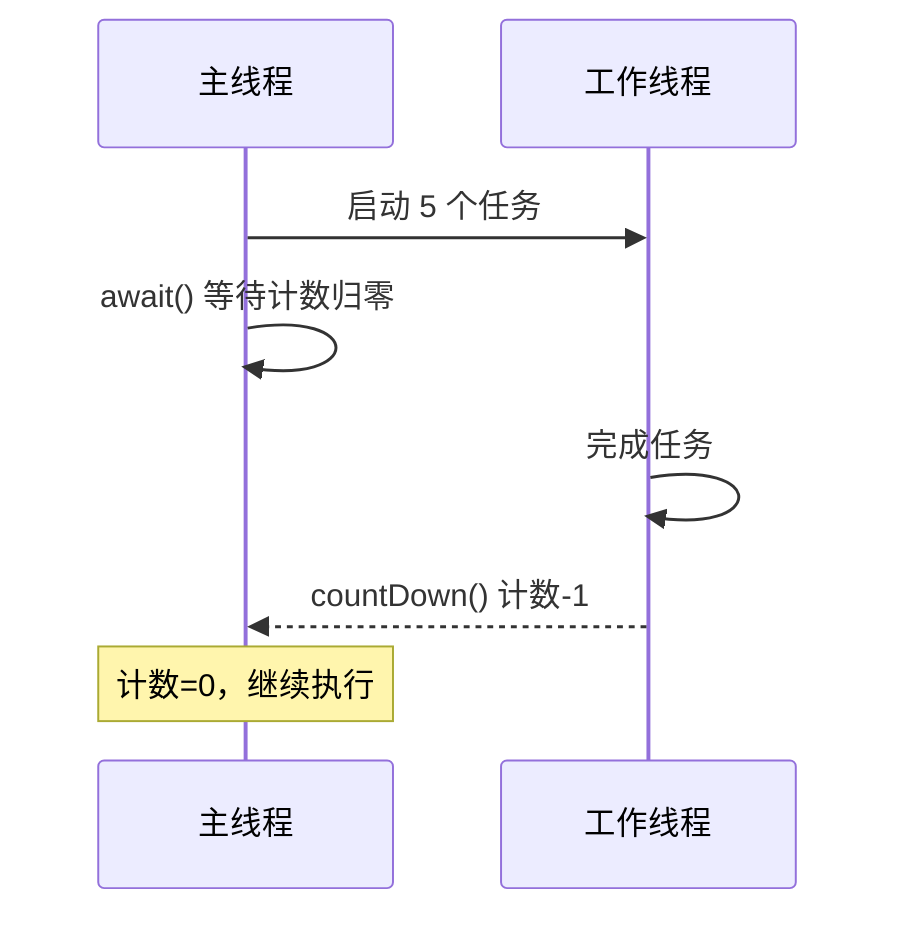

# 代码类笔记规范（五要素）

> 技术主题（语言/框架/API/算法）的笔记，代码不能只贴一段。每段关键代码必须满足五要素，缺一不可。

## 五要素清单

| # | 要素 | 要求 | 反例 |
|---|------|------|------|
| 1 | **完整可运行代码** | 能直接复制运行（含 import/上下文），不贴半截 | 只写 `latch.countDown()` 一行 |
| 2 | **输出结果** | 写明运行输出或预期效果 | 无输出，读者不知道跑完是什么样 |
| 3 | **执行流程** | 用流程描述（文字/图）讲清代码怎么跑的 | 代码贴完就结束 |
| 4 | **核心源码位置** | 关键机制标注 JDK/框架源码类名（如 `java.util.concurrent.CountDownLatch#await`），L3 必做，L2 尽量 | 讲机制却不指路源码 |
| 5 | **常见修改方式** | 给出变体：改参数会怎样 / 换实现行不行 | 代码是死的，读者不会举一反三 |

## 执行流程的两种写法

### 方式 A：文字流程（首选，简单直接）

```text
主线程                       工作线程
  |                              |
  await() 计数=5                执行任务
  |                              |
  阻塞等待 <------------------- countDown() 计数=4
  |                              |
  计数=0，放行                   ...
```

### 方式 B：mermaid 时序图（流程复杂时用）



## 代码块规范

- 语言标识必写：```java / ```python / ```bash
- 关键行加注释 `// 关键：...`，让读者视线直达重点。
- 示例追求"最小可运行"：去掉无关业务代码，保留机制核心。

## 陷阱展示格式

```markdown
> [!warning] 高频坑
> ❌ `join()` 写在 for 循环内 → 每起一个线程主线程就阻塞等它 → 实际被串行化
> ✅ 先起完所有线程，再统一 join / 用 FutureTask 收集
> 原因：join 是阻塞等待指定线程结束，循环内调用等于逐线程串行等待
```

## 源码位置标注格式

```markdown
- 核心源码：`java.util.concurrent.CountDownLatch` → `await()` / `countDown()`（AQS 的 state 计数）
- 变体：`CyclicBarrier` 用 ReentrantLock + Condition；`Semaphore` 用 AQS 共享锁
```

## 环境版本信息（技术笔记必填）

版本差异是技术笔记最大的"过期隐患"（如 `HashMap`：Java 7 头插 → Java 8 尾插+红黑树）。每篇技术笔记 frontmatter 必须记录：

```yaml
---
language: Java            # 语言/框架
version: JDK 21            # 具体版本（笔记按此版本编写）
environment:               # 可选，多组件环境
  JDK: 21
  SpringBoot: 3.x
---
```

**规则：**
- 笔记内容涉及"某版本行为"时，正文标注版本：`Java 8 起：{{行为}}`。
- 版本升级后（如 JDK 8 → 21）复习时核对：行为是否变化 → 更新正文并改 `version`。
- 无法确认当前版本行为 → 标 `❓待验证`（见 `features/fact-check.md`）。

**原则**：代码笔记是给"复习的人"看的——他能复制、能跑、能看懂流程、能定位源码、能举一反三、知道"这笔记基于哪个版本"，才算合格。
